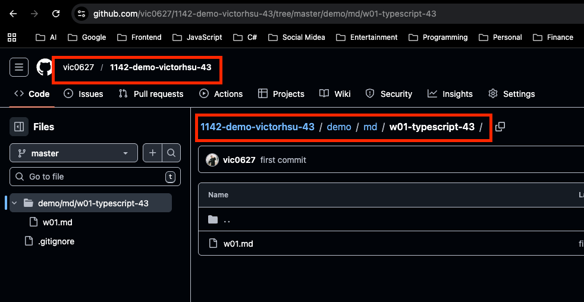
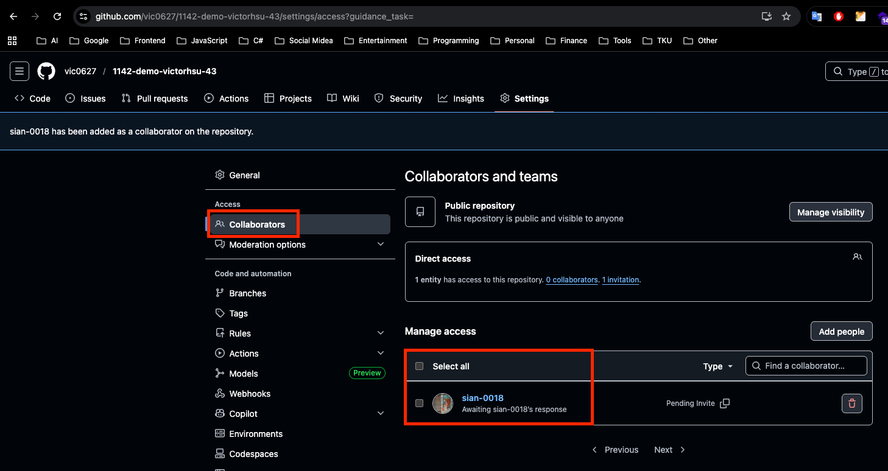
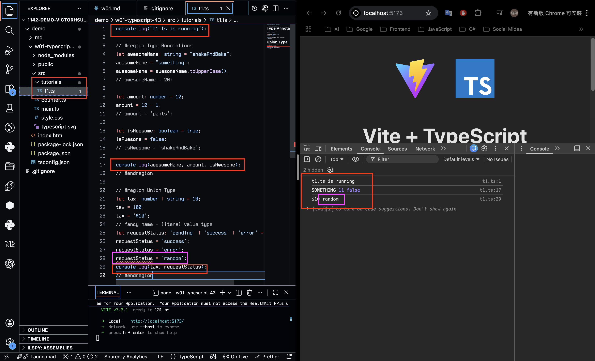
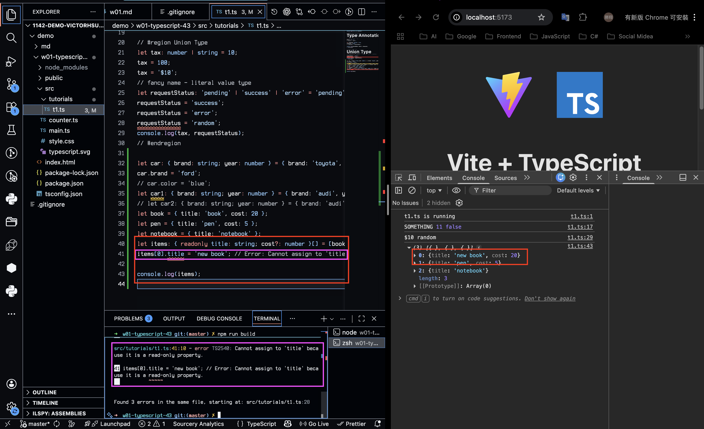
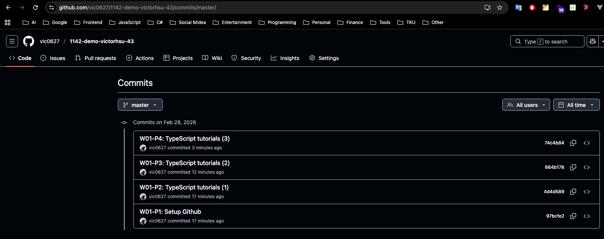

[Github URL](https://github.com/vic0627/1142-demo-victorhsu-43)

### W01-P1: Setup Github

#### => Github demo URL



#### => share to the teacher and TA



```
97bcfe2 victor_xu       Sat Feb 28 11:48:44 2026 +0800  W01-P1: Setup Github
```

### W01-P2: TypeScript tutorials (1)

#### => Type Annotation and Union Type



```
4d4d589 victor_xu       Sat Feb 28 11:48:44 2026 +0800  W01-P2: TypeScript tutorials (1)
```

### W01-P3: TypeScript tutorials (2)

#### => Object Fundamental, npm run build error when typechecking failed



```
664b178 victor_xu       Sat Feb 28 12:06:25 2026 +0800  W01-P3: TypeScript tutorials (2)
```

### W01-P4: TypeScript tutorials (3)

#### => Function Fundamentals


```
74c4b84 victor_xu       Sat Feb 28 12:14:45 2026 +0800  W01-P4: TypeScript tutorials (3)
```

### W01-logs: git logs of W01


