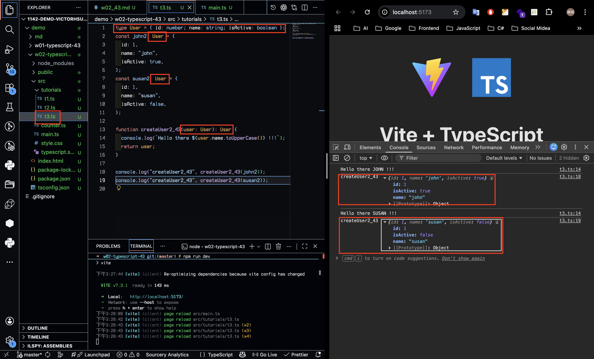
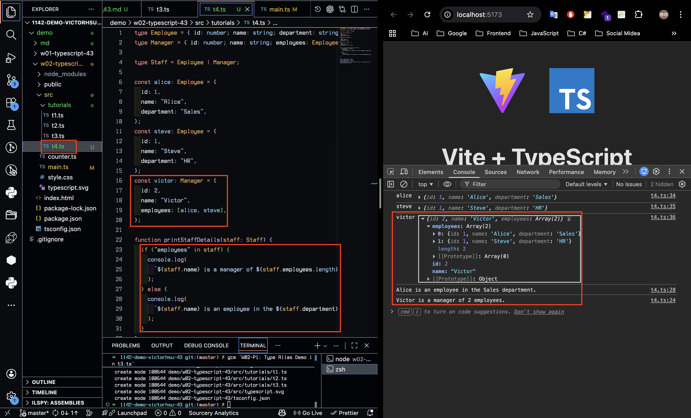
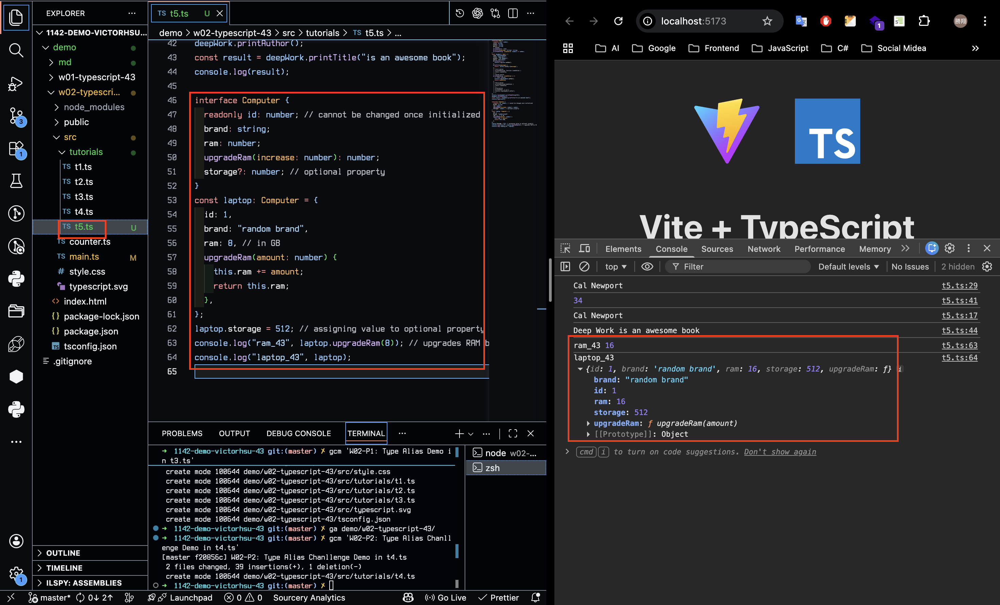
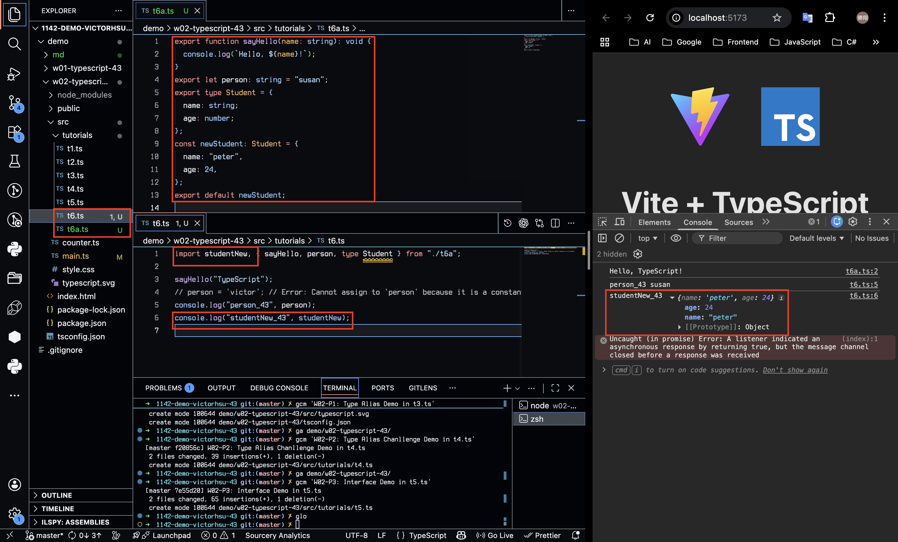
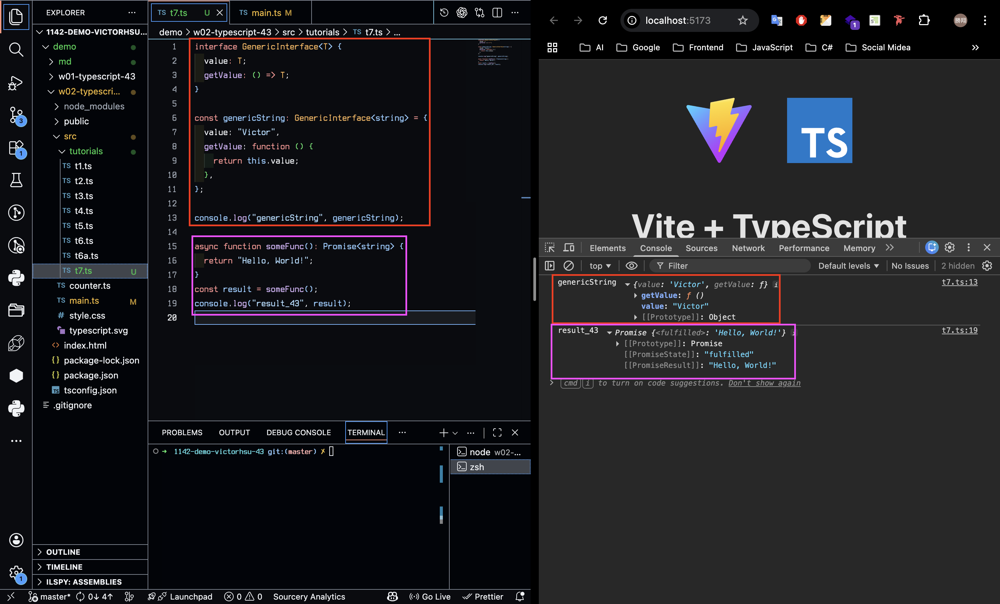
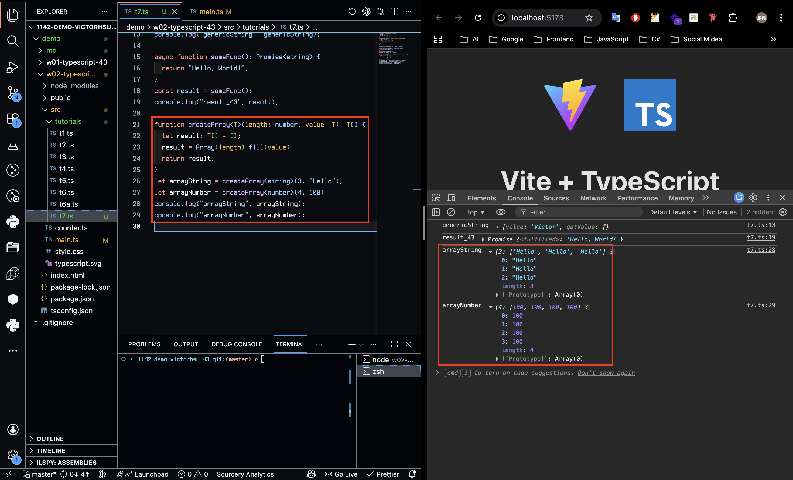
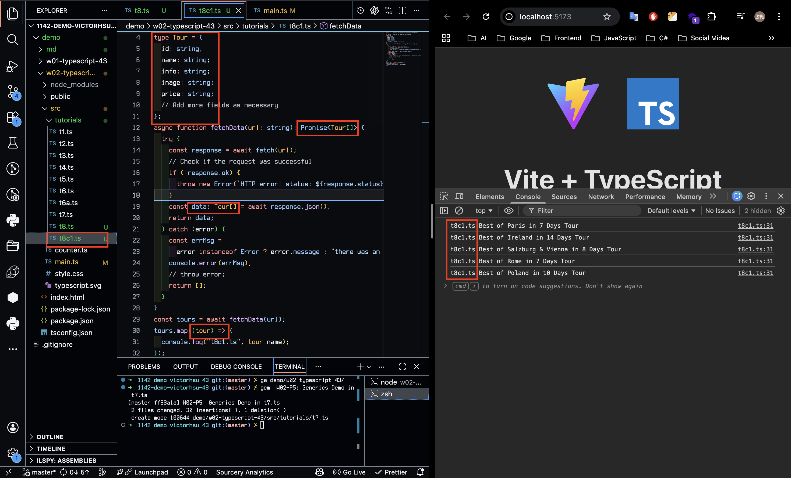
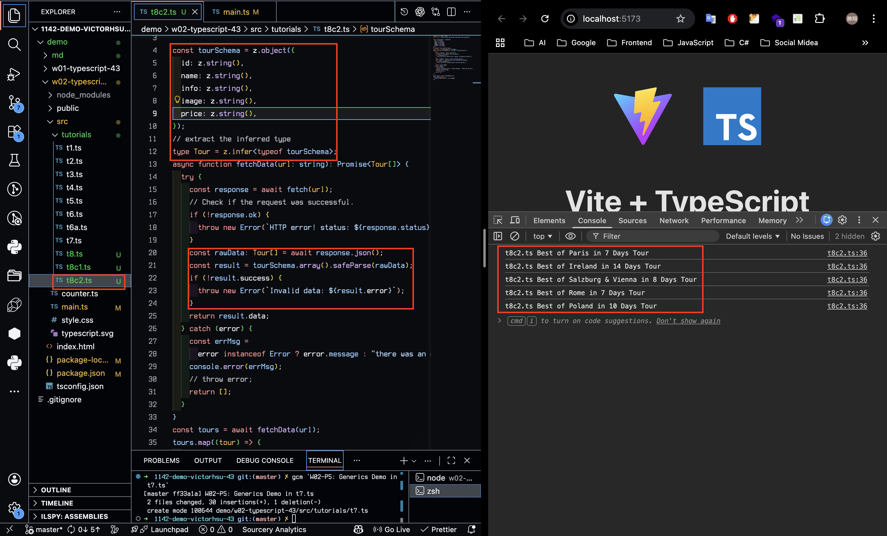
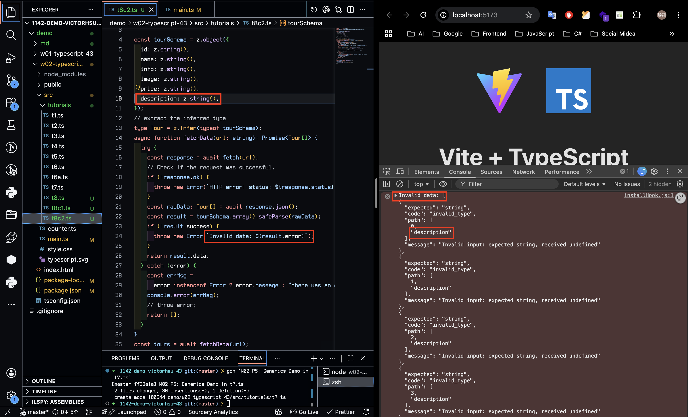
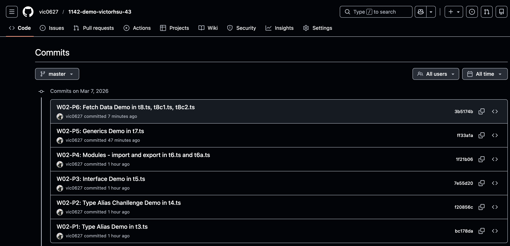

[Github URL](https://github.com/vic0627/1142-demo-victorhsu-43)

### W02-P1: Type Alias Demo in t3.ts



```
bc178da victor_xu       Sat Mar 7 15:31:23 2026 +0800   W02-P1: Type Alias Demo in t3.ts
```

### W02-P2: Type Alias Chanllenge Demo in t4.ts



```
f20856c victor_xu       Sat Mar 7 15:37:48 2026 +0800   W02-P2: Type Alias Chanllenge Demo in t4.ts
```

### W02-P3: Interface Demo in t5.ts



```
7e55d20 victor_xu       Sat Mar 7 15:42:51 2026 +0800   W02-P3: Interface Demo in t5.ts
```

### W02-P4: Modules - import and export in t6.ts and t6a.ts



```
1f21b06 victor_xu       Sat Mar 7 15:52:03 2026 +0800   W02-P4: Modules - import and export in t6.ts and t6a.ts
```

### W02-P5: Generics Demo in t7.ts

#### => interface GenericInterface<T>



#### => createArray<T>(length: number, value: T): Array<T>



```
ff33a1a victor_xu       Sat Mar 7 16:00:17 2026 +0800   W02-P5: Generics Demo in t7.ts
```

### W02-P6: Fetch Data Demo in t8.ts, t8c1.ts, t8c2.ts

#### => add Tour type



#### => use zod to validate data (success)



#### => use zod to validate data (invalid data)



```
3b5174b victor_xu       Sat Mar 7 16:41:03 2026 +0800   W02-P6: Fetch Data Demo in t8.ts, t8c1.ts, t8c2.ts
```

### W02-logs: git logs of W02


