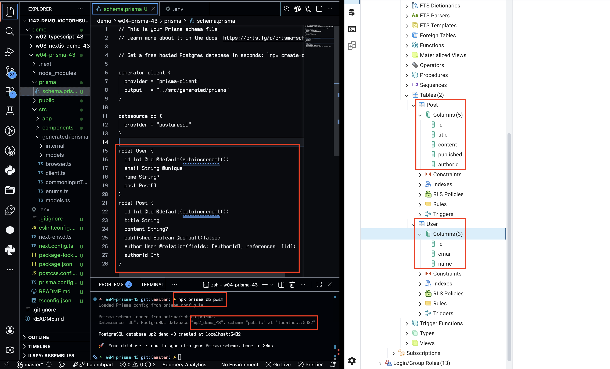
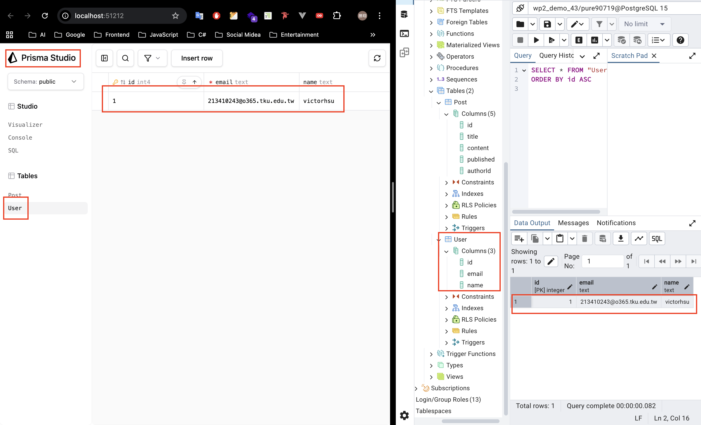
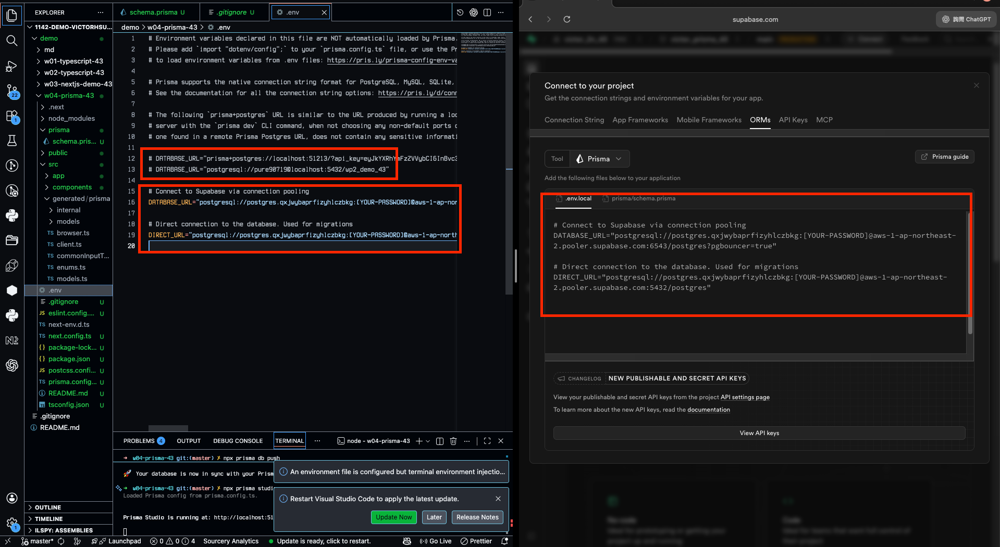
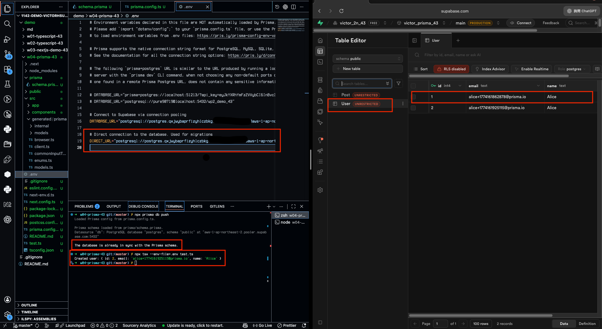
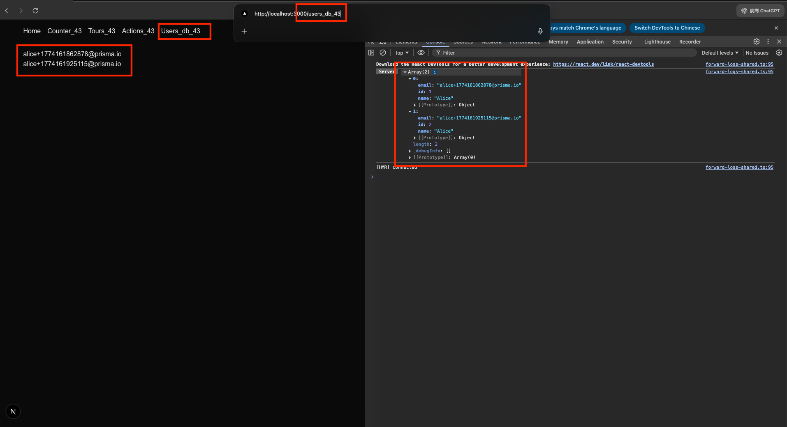
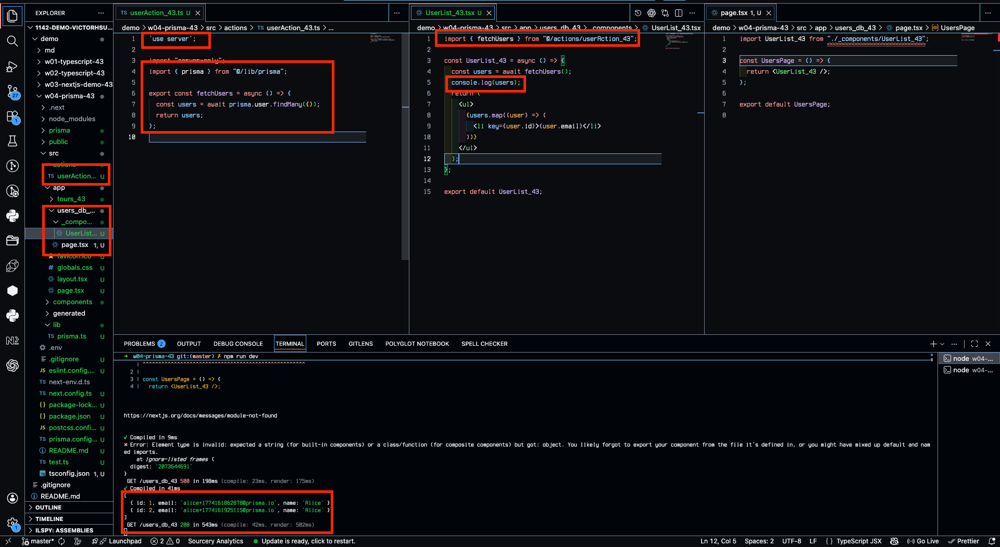
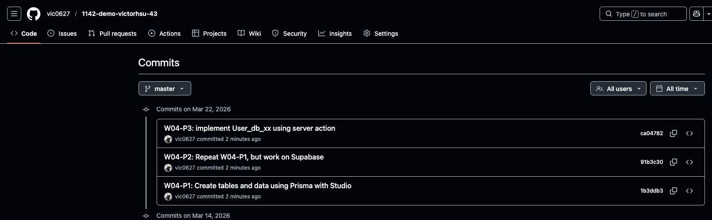

[Github URL](https://github.com/vic0627/1142-demo-victorhsu-43)

### W04-P1: Create tables and data using Prisma with Studio

#### => npx prisma db push



#### => add one user (your info), show in Prisma Studio and pgAdmin



```
1b3ddb3 victor_xu       Sun Mar 22 15:09:41 2026 +0800  W04-P1: Create tables and data using Prisma with Studio
```

### W04-P2: Repeat W04-P1, but work on Supabase

#### => connection setting in Supabase



#### => reset database password in Supabase


公開 db 密碼？？？？？？？？sure？？？？？？？？？？？？？？？？？？？

#### => npx prisma db push & run test.ts to add 1 user with 1 post



```
91b3c30 victor_xu       Sun Mar 22 15:09:57 2026 +0800  W04-P2: Repeat W04-P1, but work on Supabase
```

### W04-P3: implement User_db_43 using server action

#### => Chrome, show 2 users fetch from Supabase



#### => show the code, the concept of server action



```
ca04782 victor_xu       Sun Mar 22 15:10:10 2026 +0800  W04-P3: implement User_db_43 using server action
```

### W04-logs: git logs of W04


