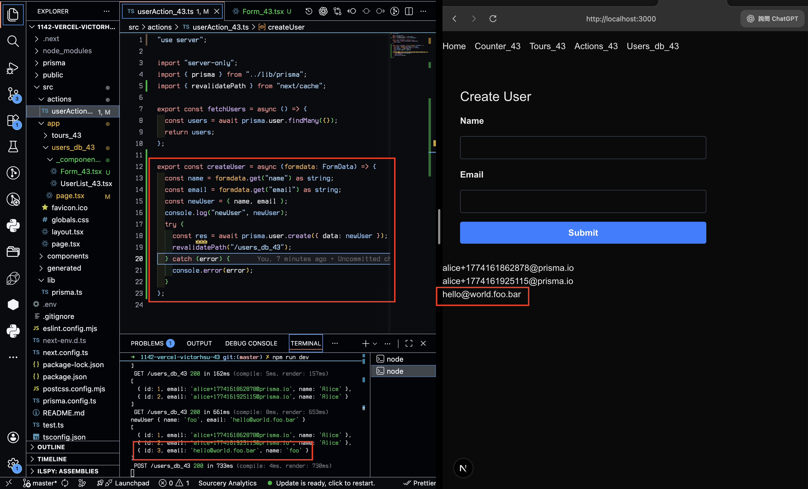
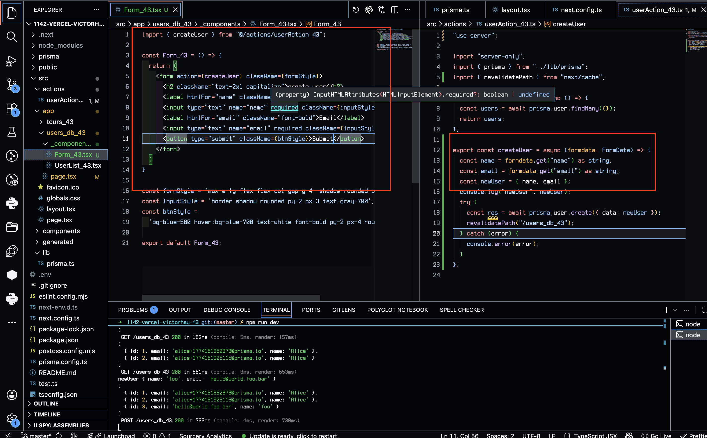
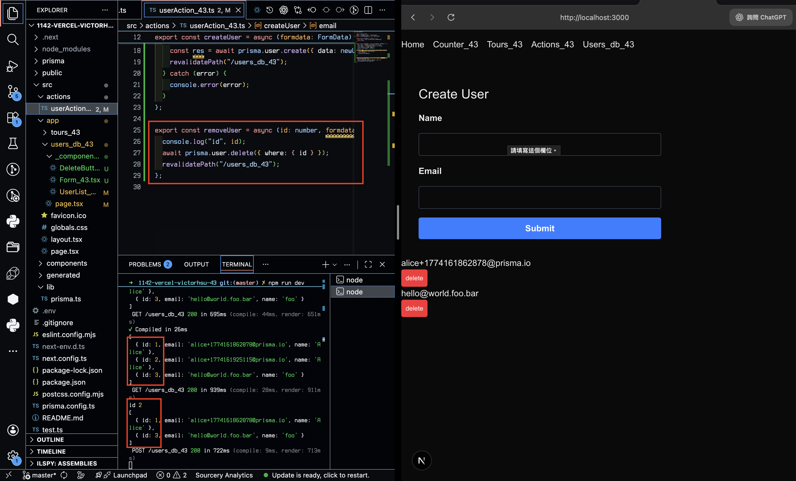
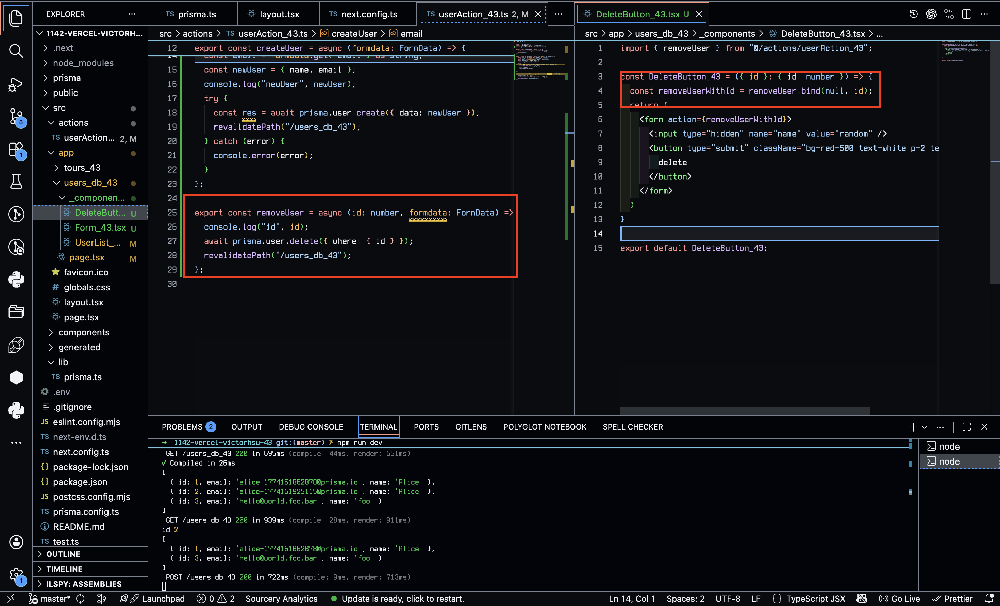
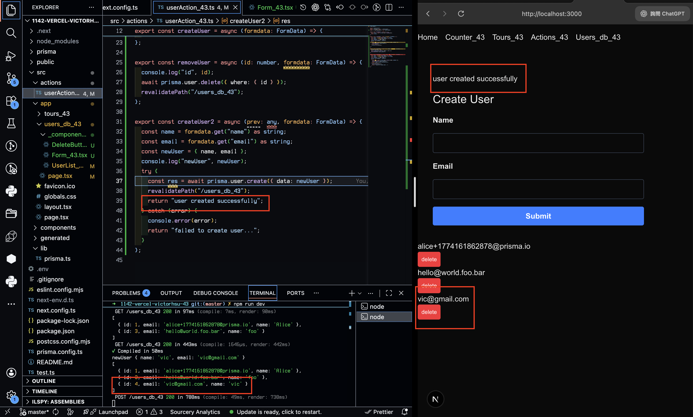
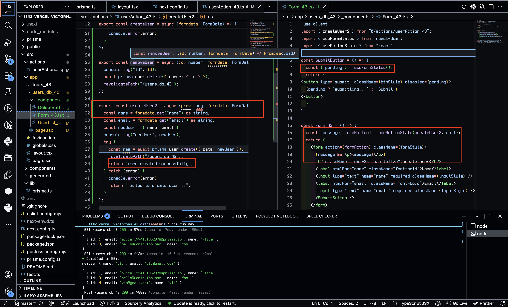
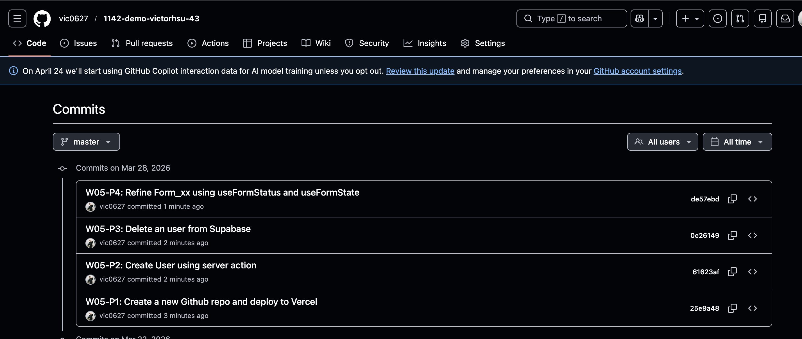

[Github URL](https://github.com/vic0627/1142-demo-victorhsu-43)

### W05-P1: Create a new Github repo and deploy to Vercel
 
#### => "npm run build" with success
 

 
#### => Deploy to Vercel, add env variables
 

 
#### => Show users fetch from Supabase
 

 
#### => Github repo with Vercel link
 

 
```
25e9a48 victor_xu       Sat Mar 28 16:41:45 2026 +0800  W05-P1: Create a new Github repo and deploy to Vercel
```

### W05-P2: Create User using server action
 
#### => input an user and save it to Supabase
 

 
#### => show how formData works
 

 
```
61623af victor_xu       Sat Mar 28 16:42:20 2026 +0800  W05-P2: Create User using server action
```

### W05-P3: Delete an user from Supabase
 
#### => from console.log show an user being deleted
 

 
#### => show how code is working
 

 
```
0e26149 victor_xu       Sat Mar 28 16:42:56 2026 +0800  W05-P3: Delete an user from Supabase
```

### W05-P4: Refine Form_xx using useFormStatus and useFormState
 
#### => create an user and show return message
 

 
#### => show how code is working
 

 
```
de57ebd victor_xu       Sat Mar 28 16:43:32 2026 +0800  W05-P4: Refine Form_xx using useFormStatus and useFormState
```

### W05-logs: git logs of W05


