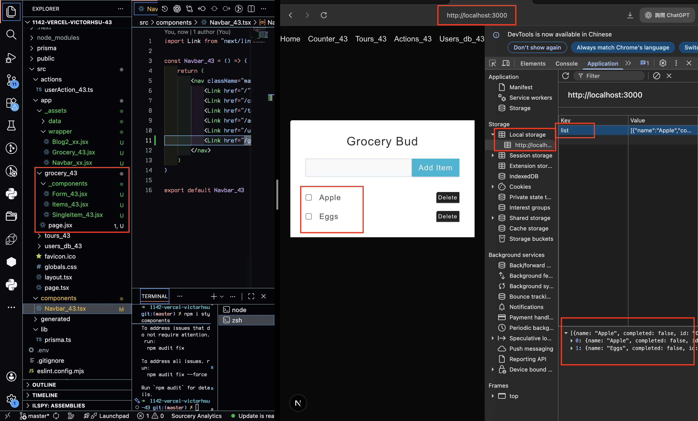
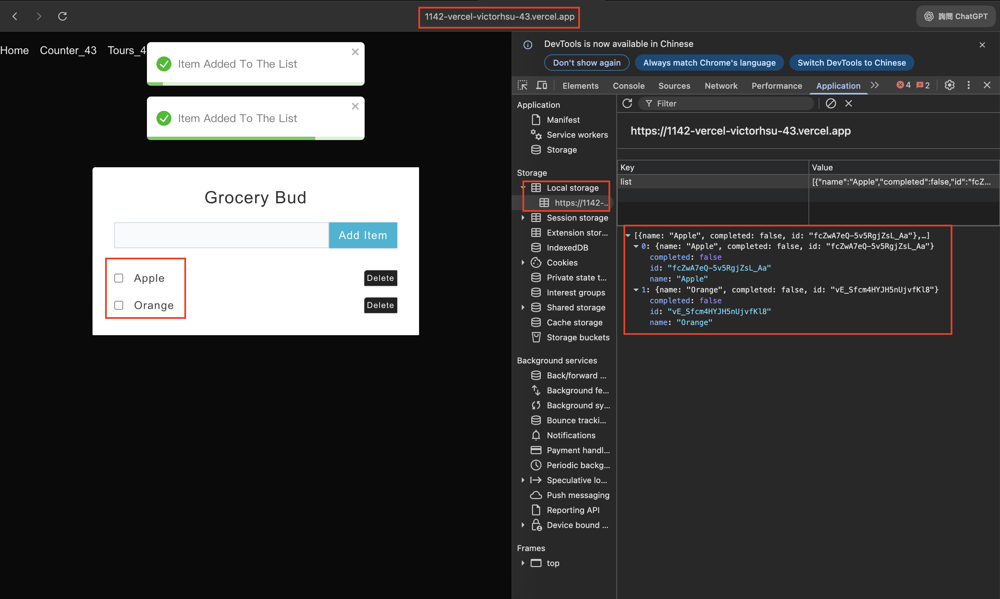
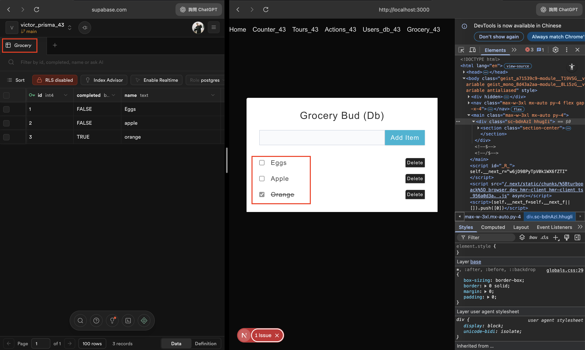
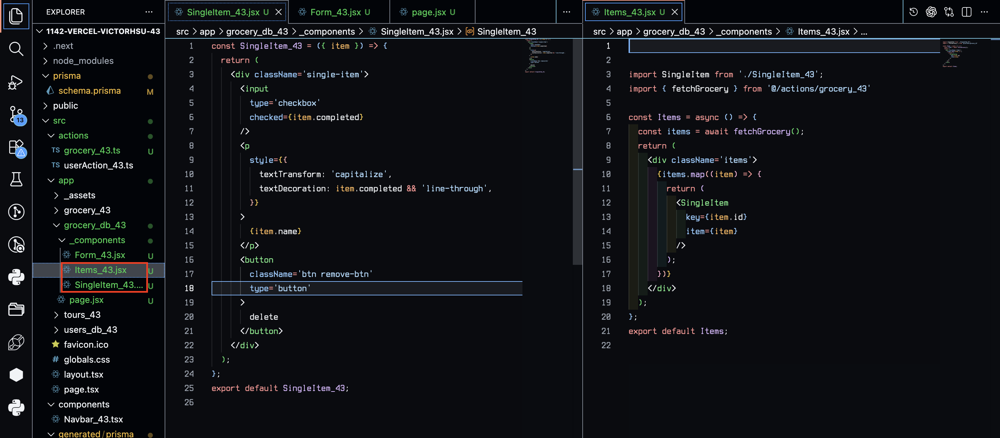
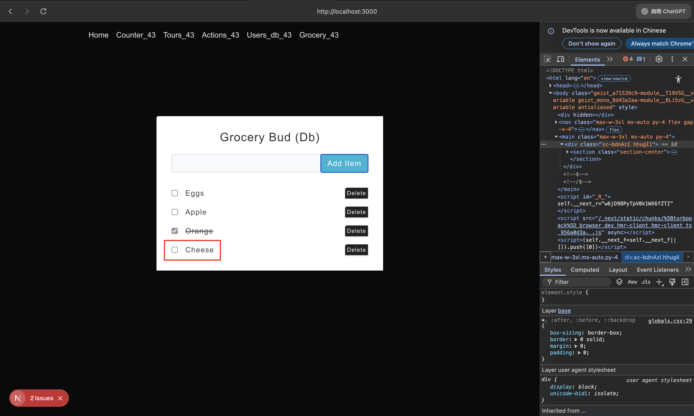
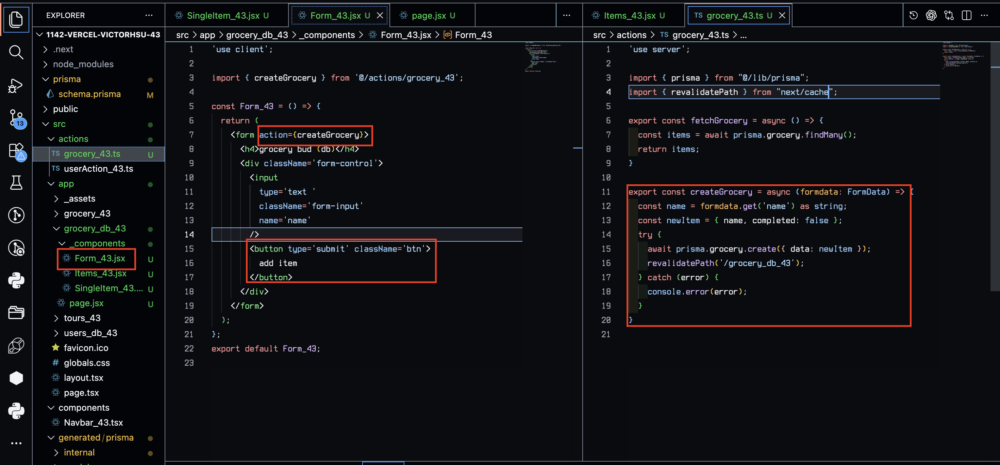
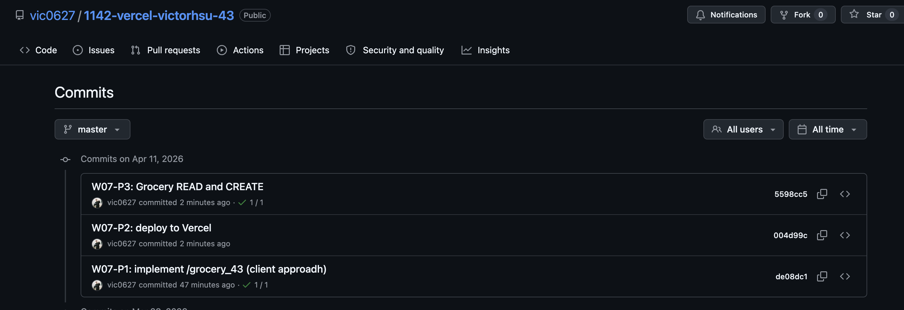

[Github URL](https://github.com/vic0627/1142-demo-victorhsu-43)

### W07-P1: implement /grocery_43 (client approadh)
 
#### => Add two items, and show the local storage
 

 
```
de08dc1 victor_xu       Sat Apr 11 16:24:15 2026 +0800  W07-P1: implement /grocery_43 (client approadh)
```

### W07-P2: deploy to Vercel
 
#### => show /grocery_43 in Vercel
 

 
```
004d99c victor_xu       Sat Apr 11 17:08:55 2026 +0800  W07-P2: deploy to Vercel
```

### W07-P3: Grocery READ and CREATE
 
#### => Add 3 items into Grocery database table and fetch these three items (READ)
 

 
#### => code for READ all items
 

 
#### => Add a item cheese (CREATE)
 

 
#### => code for CREATE a item
 

 
```
5598cc5 victor_xu       Sat Apr 11 17:09:10 2026 +0800  W07-P3: Grocery READ and CREATE
```

### W07-logs: git logs of W07


