[My github URL](https://github.com/vic0627/1142-demo-victorhsu-43)
[Vercel URL](https://1142-demo-victorhsu-43.vercel.app/)
[Name] victor hsu
[Student ID] 213410243


W10-P1: Move all routes under app into (demo) folder, and run Tour successfully
 
#### => Chrome with code
 
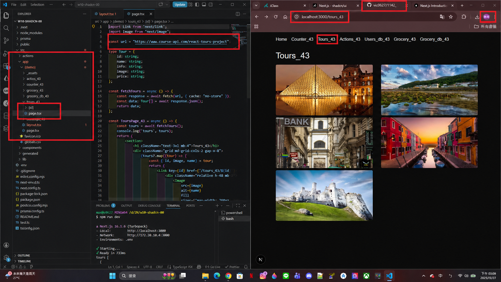
 
```
1f8d271	victor hsu	Thu Apr 30 16:43:19 2026 +0800	W10-P1: Move all routes under app into (demo) folder, and run Tour successfully
```

W10-P2: Create NavbarMain_43 with 5 menubar and a ModeToggle that can change theme
 
#### => light mode, code for MavbarMain_43
 
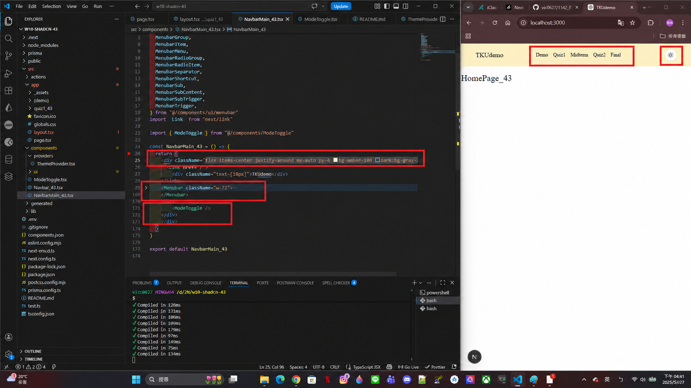
 
#### => dark mode, ThemeProvider setup
 
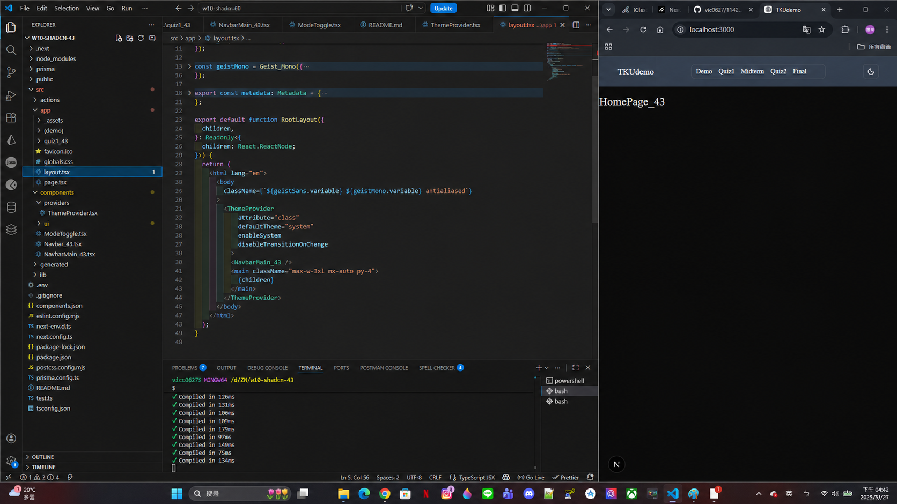
 
```
cb4c198	victor hsu	Thu Apr 30 16:44:05 2026 +0800	W10-P2: Create NavbarMain_43 with 5 menubar and a ModeToggle that can change theme
```
W10-P3: Implement Demo menubar with 5 items
 
#### => Show Tours_43 (local)
 
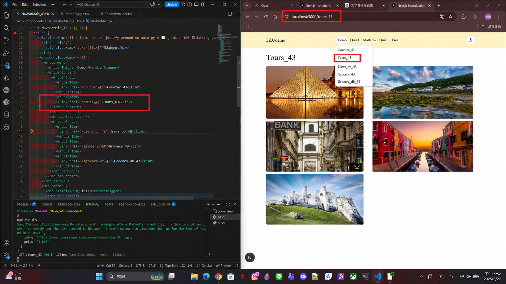
 
#### => Show Users_db_43 (local)
 
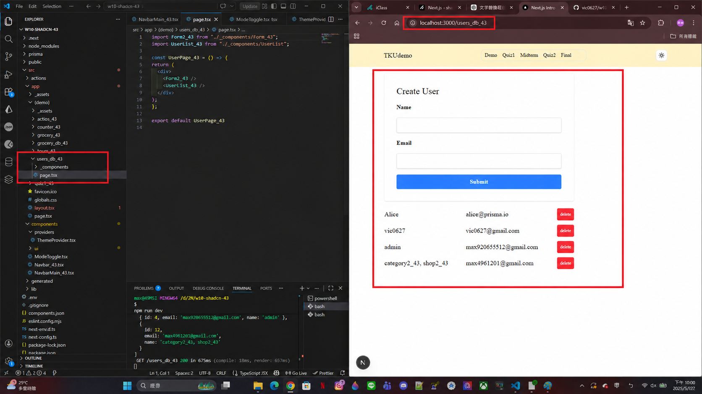
 
#### => Show Grocery_43 in Vercel
 
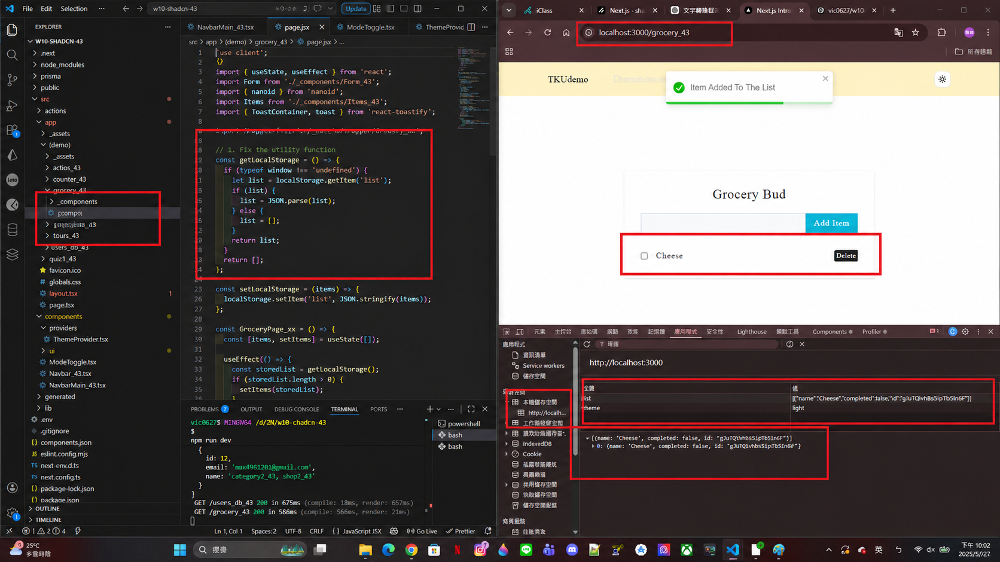
 
#### => Show Grocery_db_43 in vercel
 
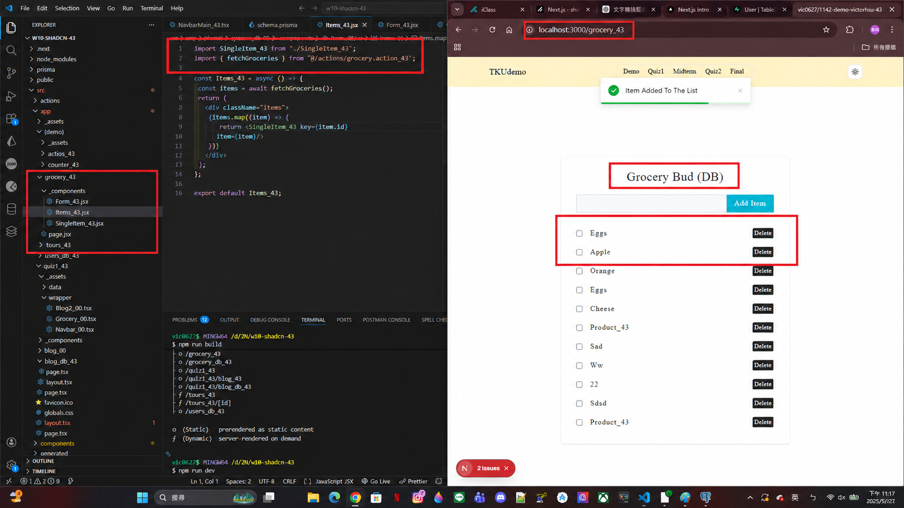
 
```
1957461	victor hsu	Sat May 2 23:19:40 2026 +0800	W10-P3: Implement Demo menubar with 5 items
```

W10-P4: Implement Quiz1 menubar with 2 items
 
#### => Show Quiz1 menubar in Vercel
 
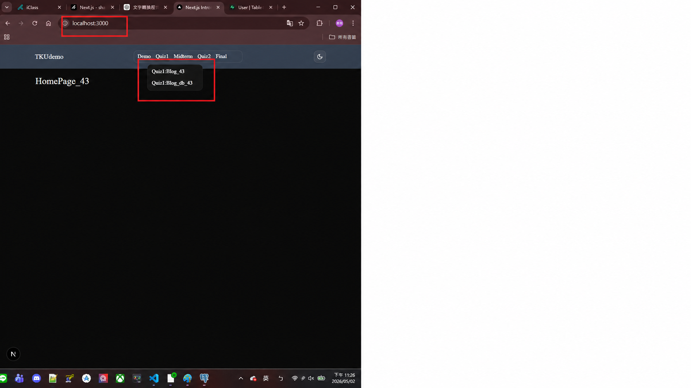
 
#### => Show blog_43 in Vercel
 
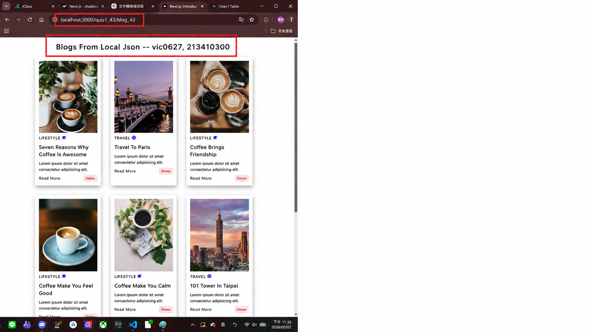
 
#### => Show blog_db_43 in Vercel
 
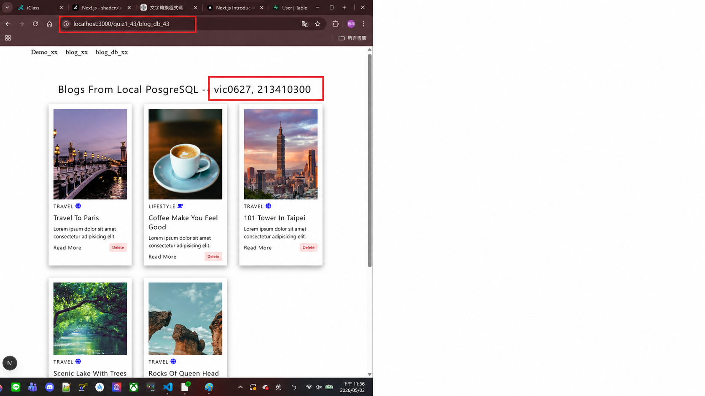
 
```
4512726	victor hsu	Sat May 2 23:38:06 2026 +0800	W10-P4: Implement Quiz1 menubar with 2 items
```

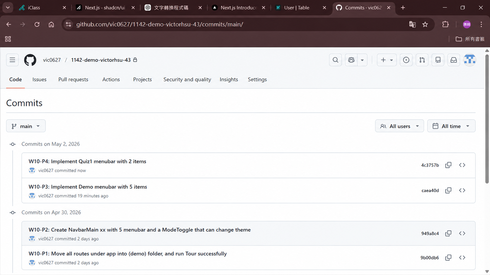
