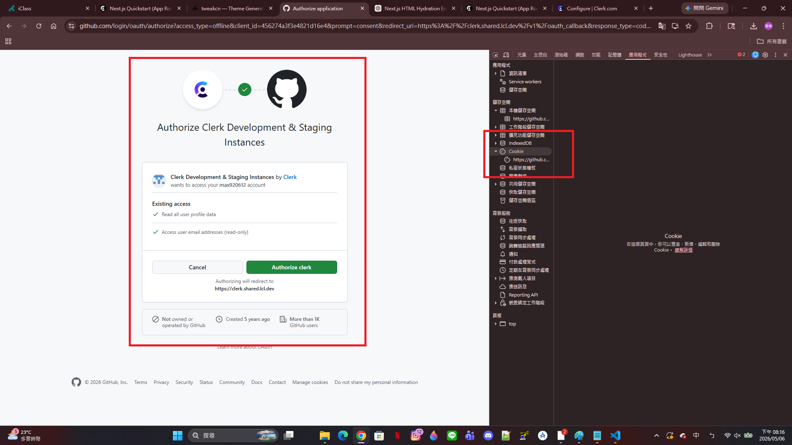
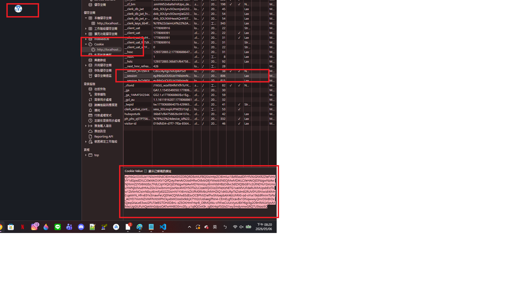
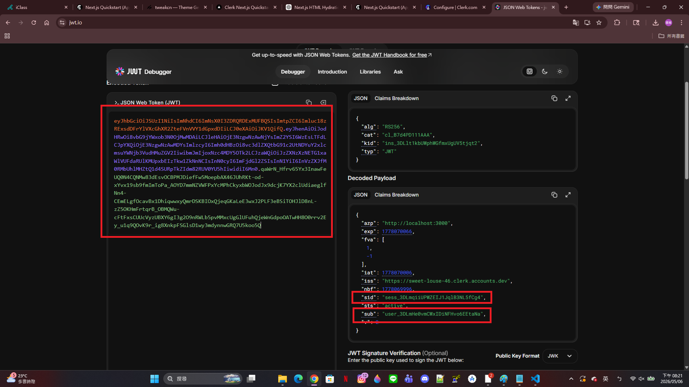
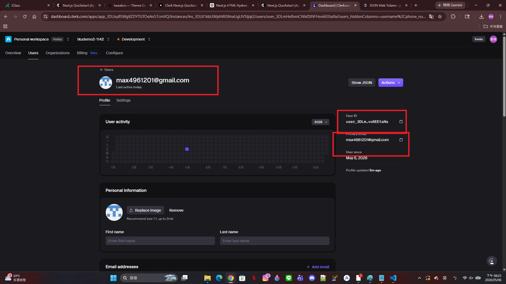
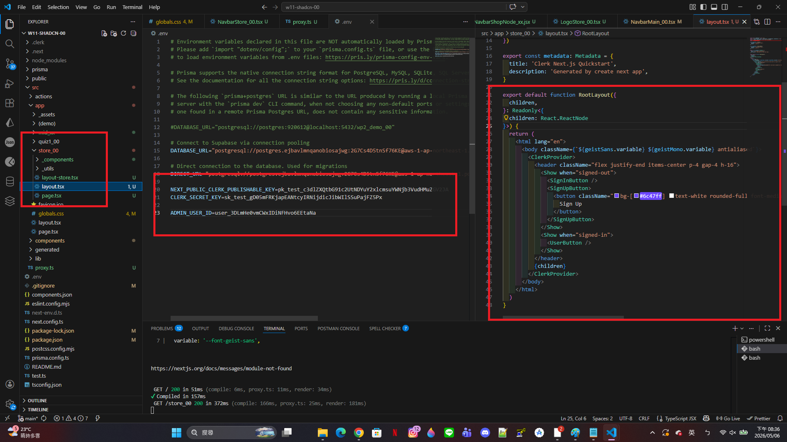
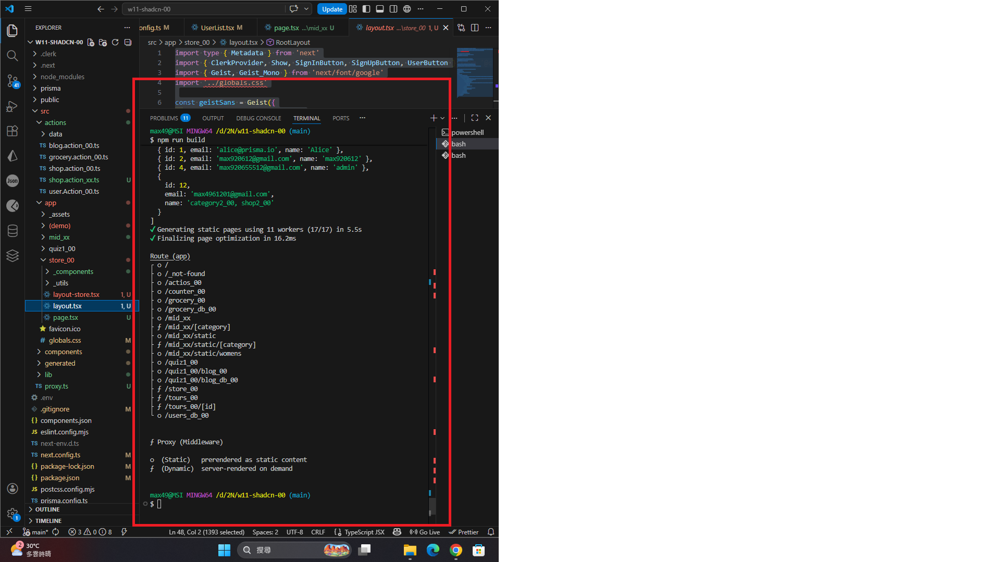
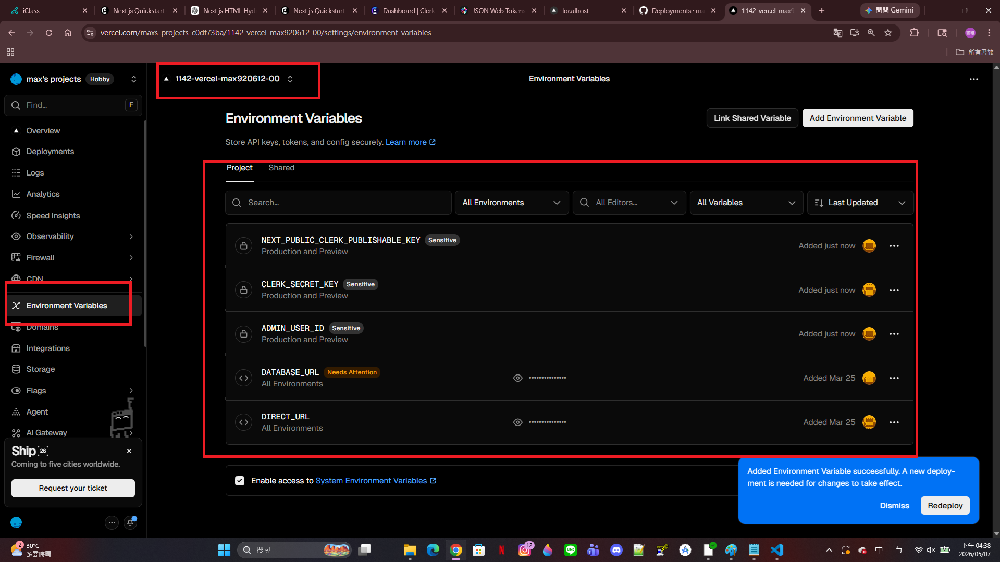
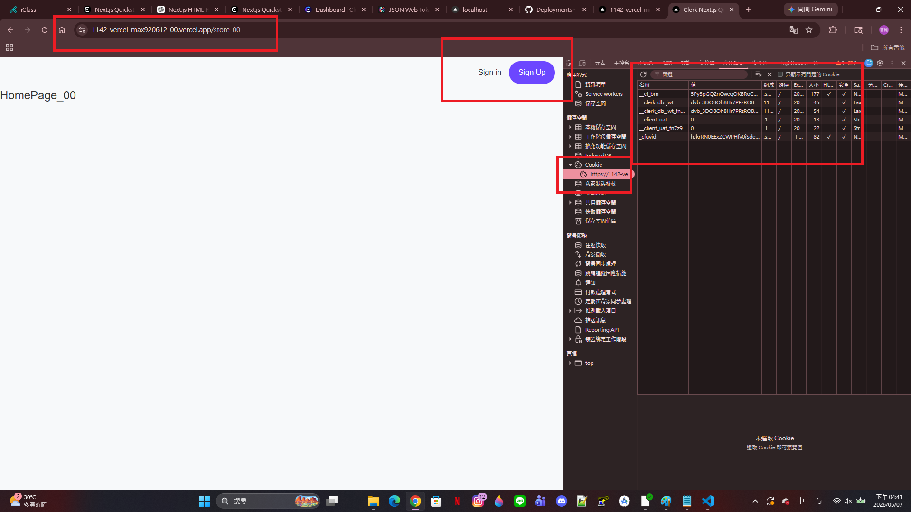
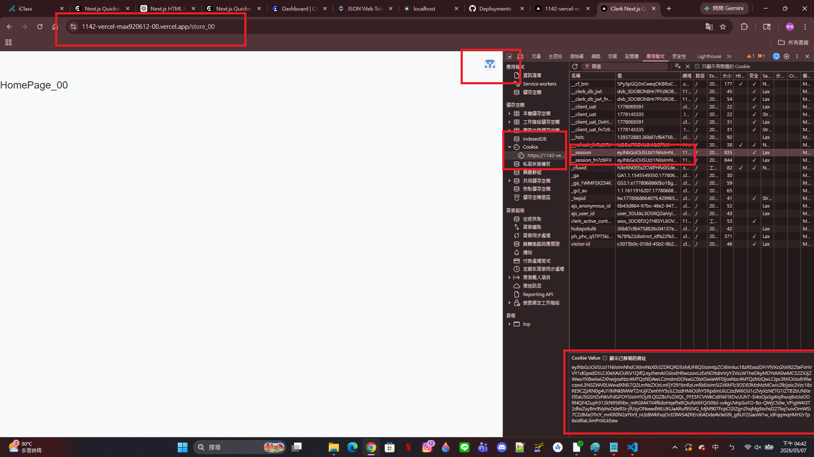
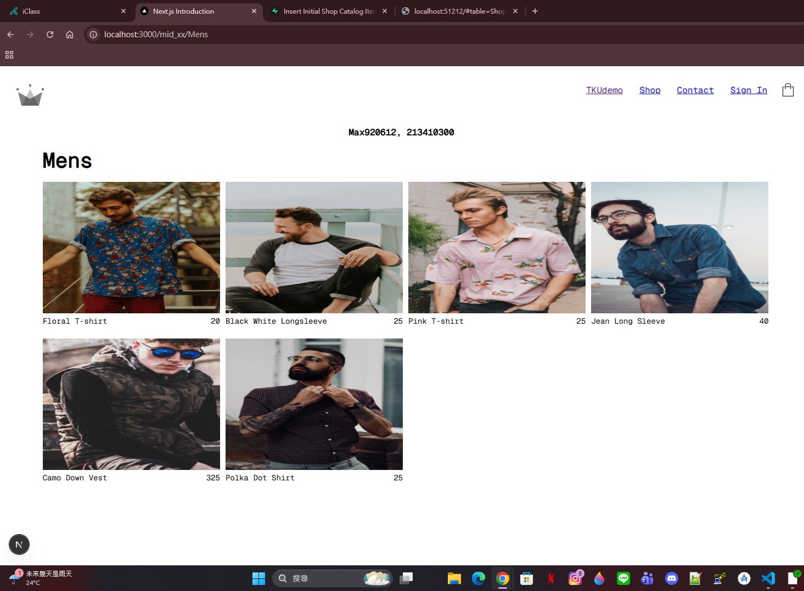

[My github URL](https://github.com/vic0627/1142-demo-victorhsu-43)
[Vercel URL](https://1142-demo-victorhsu-43.vercel.app/)
[Name] victor hsu
[Student ID] 213410243


### W11-P1: Clerk Setup and test
 
#### => Sign In using Github
 

 
#### => get jwt token from Clerk
 

 
#### => verify jwt token from jwt.io
 

 
#### => get User_ID from Clerk
 

 
#### => set ADMIN_USER_ID using this User_ID
 

 
```
4654ca2 victor hsu Wed May 6 20:57:08 2026 +0800   W11-P1: Clerk Setup and test
```

W11-P2: Make code work in Vercel
 
#### => npm run build successfully
 

 
#### => add new env to Vercel
 

 
#### => test in Vercel, not yet login
 

 
#### => test in Vercel, login and get jwt token
 

 
```
8b45686 victor hsu Wed May 6 20:58:31 2026 +0800   W11-P2: Make code work in Vercel
```
W11-P3: Make /mid_43 to work in Vercel
 
#### => show Mens products
 

 
```
7433996 victor hsu Wed May 6 21:01:19 2026 +0800   W11-P3: Make /mid_43 to work in Vercel
```

