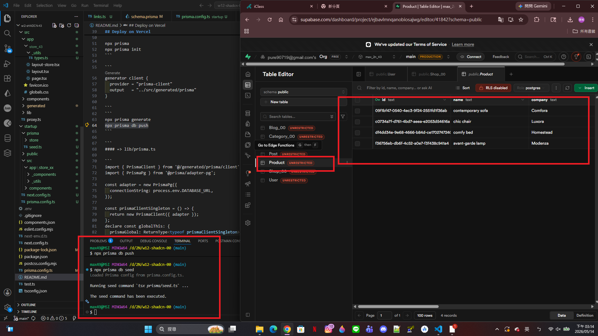
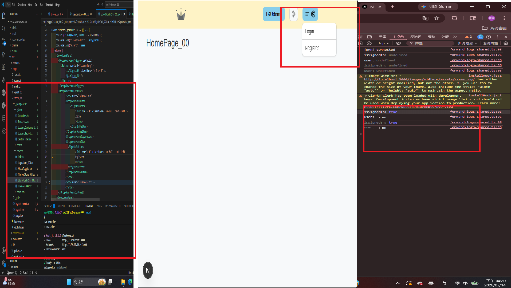
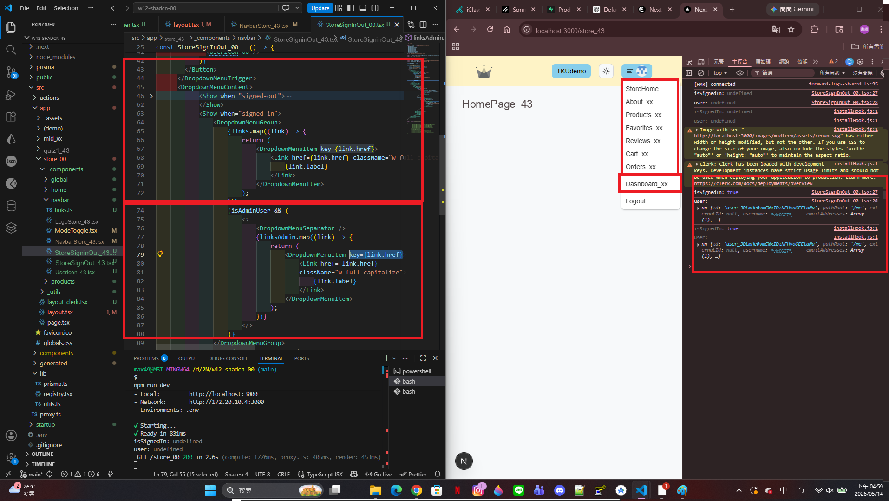
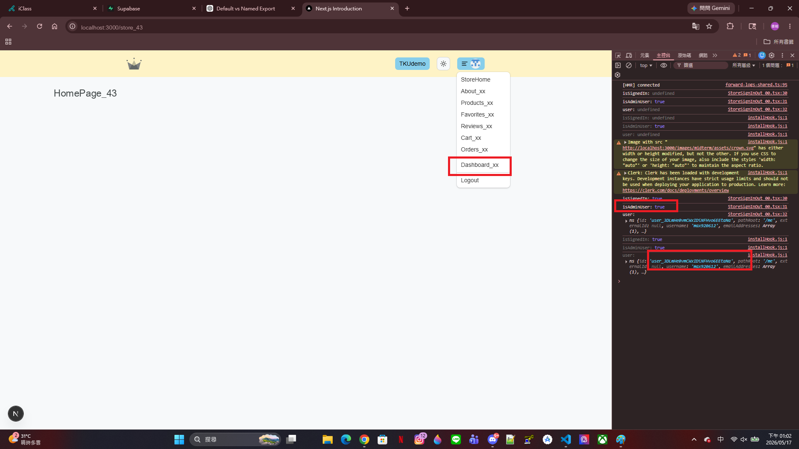
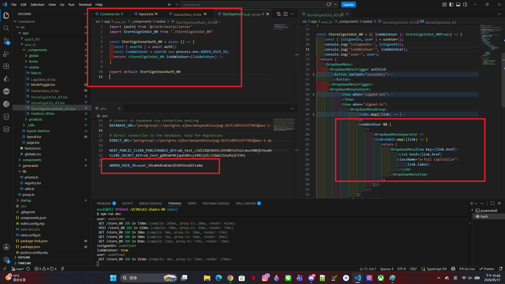
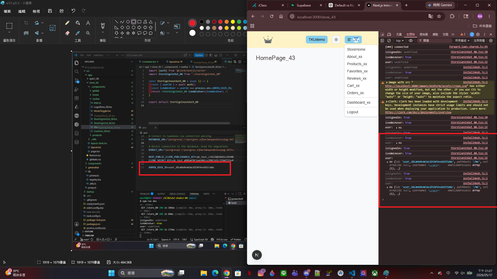
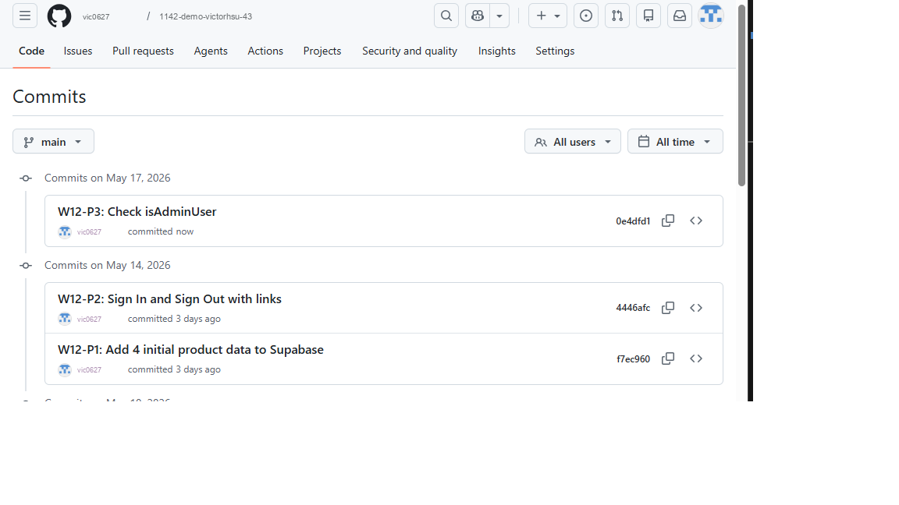

[My github URL](https://github.com/vic0627/1142-demo-victorhsu-43)
[Vercel URL](https://1142-demo-victorhsu-43.vercel.app/)
[Name] victor hsu
[Student ID] 213410243


W12-P1: Add 4 initial product data to Supabase
 
#### => npx prisma db seed to add 4 data
 

 
```
d700cf1	victor hsu	Thu May 14 15:26:10 2026 +0800	W12-P1: Add 4 initial product data to Supabase
```

W12-P2: Sign In and Sign Out with links
 
#### => Not signed in, show Login and Register
 

 
#### => already signed in, show links, linksAdmin, and Logout
 

 
```
b53d33d	victor hsu	Thu May 14 17:01:12 2026 +0800	W12-P2: Sign In and Sign Out with links
```

W12-P3: Check isAdminUser
 
#### => isAdminUser is true, shown in Chrome
 

 
#### => related code for checking isAdminUser
 

 
#### => isAdminUser is false
 

 
```
c0c447f	victor hsu	Sun May 17 13:09:16 2026 +0800	W12-P3: Check isAdminUser
```


