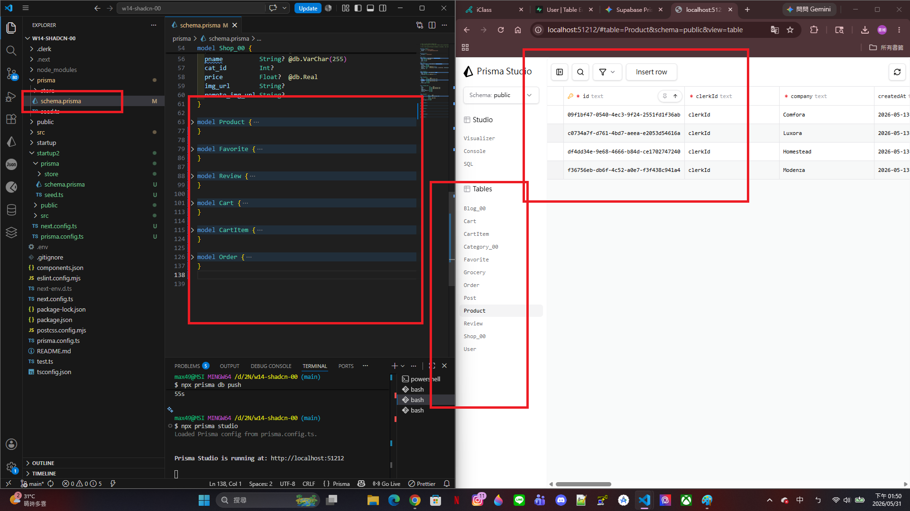
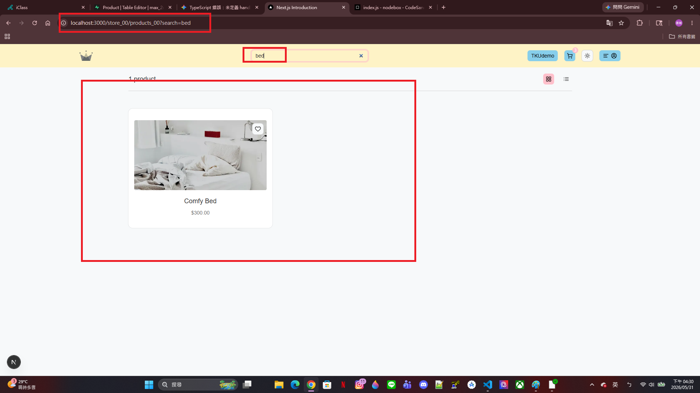
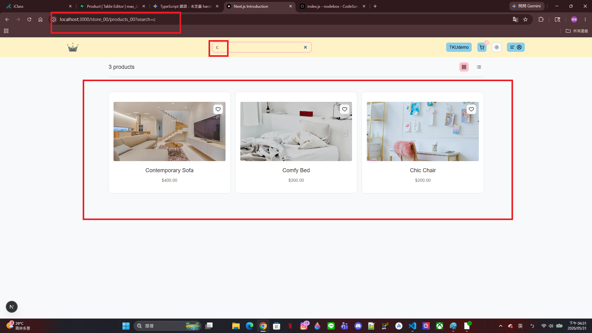
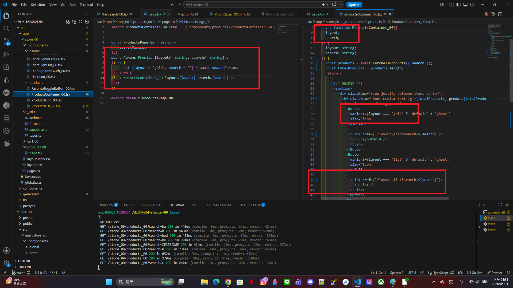
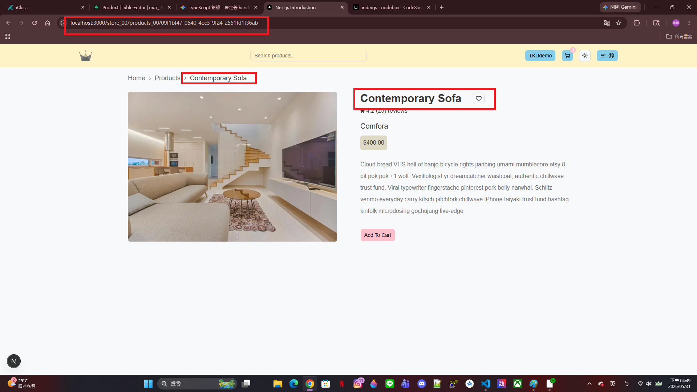
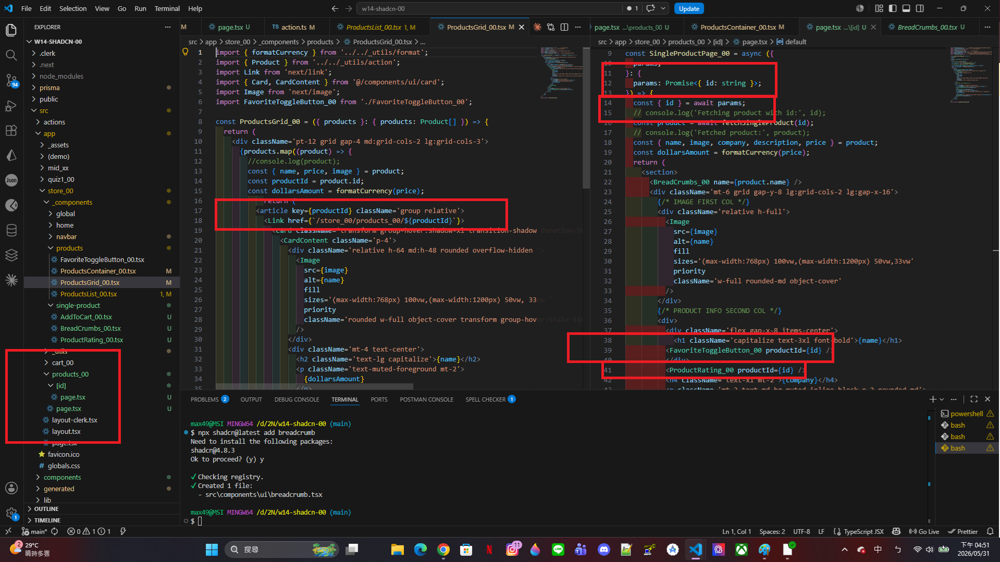
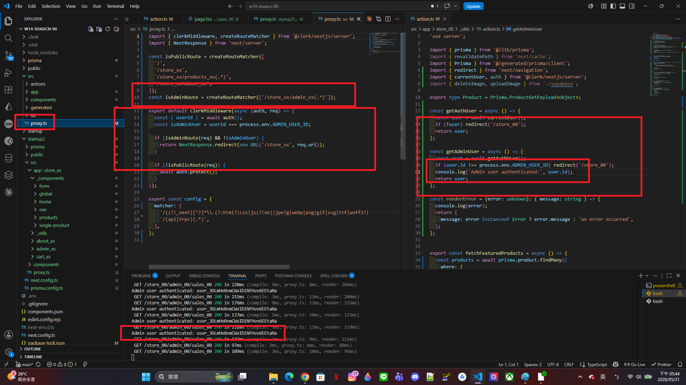
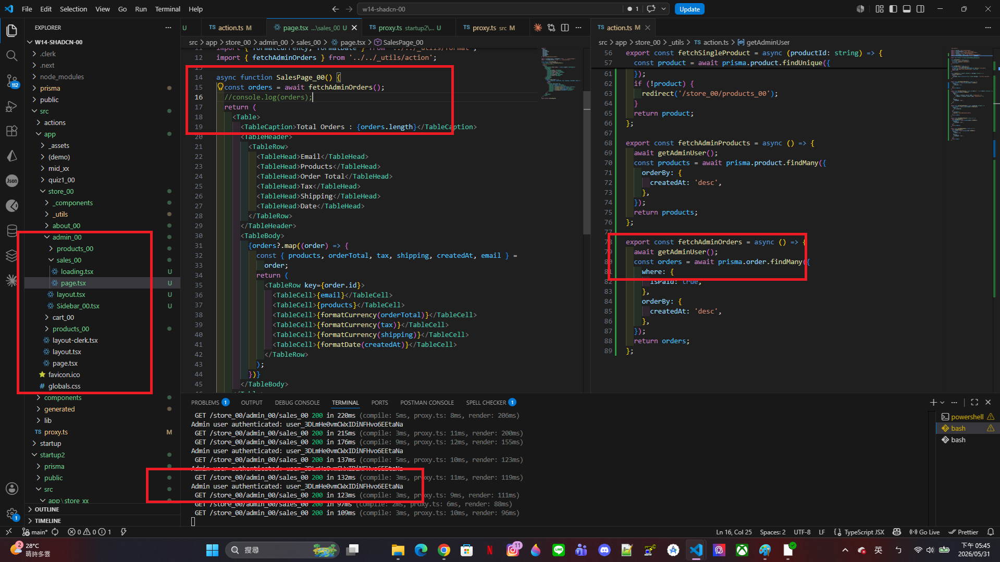
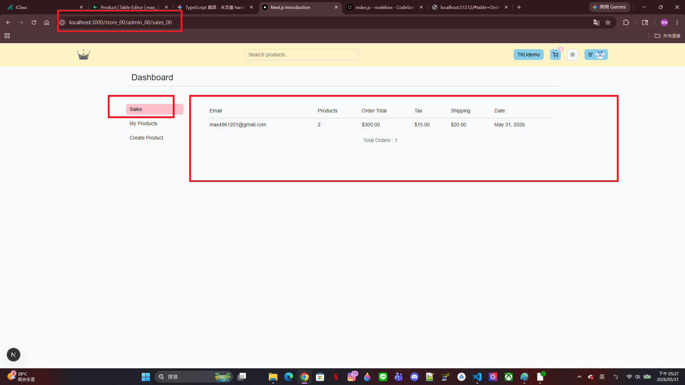
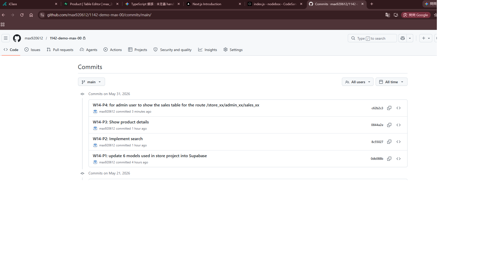

[My github URL](https://github.com/vic0627/1142-demo-victorhsu-43)
[Vercel URL](https://1142-demo-victorhsu-43.vercel.app/)
[Name] victor hsu
[Student ID] 213410243


W14-P1: update 6 models used in store project into Supabase
 
#### => npx prisma db push
 

 
```
a814bb6 victor hsu Wed May 27 18:36:52 2026 +0800  W14-P1: update 6 models used in store project into Supabase
```

W14-P2: Implement search
 
#### => params: "layout=list&search=bed"
 

 
#### => params: "layout=grid&search=c"
 

 
#### => related code for "layout=grid&search=c"
 

 
```
5af85c9 victor hsu Wed May 27 19:39:29 2026 +0800  W14-P2: Implement search
```

W14-P3: Show product details
 
#### => Chrome output
 

 
#### => related code
 

 
```
d424819 victor hsu Wed May 27 20:05:11 2026 +0800  W14-P3: Show product details
```

W14-P4: for admin user to show the sales table for the route /store_43/admin_43/sales_43
 
#### => proxy.tsx and getAdminUser
 

 
#### => code for checking admin user
 

 
#### => Chrome display
 

 
```
9200a9c victor hsu Wed May 27 20:58:31 2026 +0800  W14-P4: for admin user to show the sales table for the route /store_43/admin_43/sales_43
```

